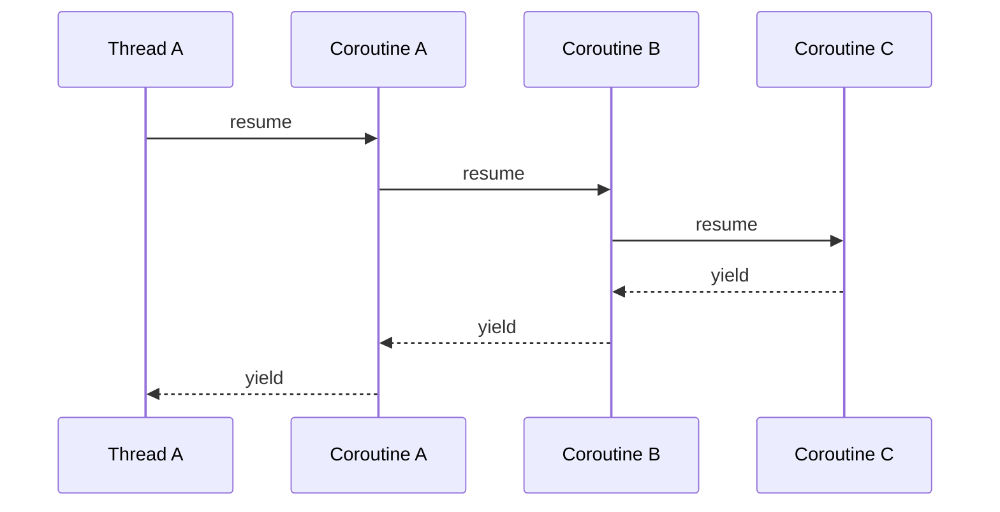

# tigerkin

## 开发环境

* CentOS Linux release 8.4.2105
* gcc version 8.4.1
* gcc-c++ version 8.4.1
* cmake version 3.18.2
* boost version 1.66.0
* boost-devel version 1.66.0
* yaml-cpp version 0.6.2

## 配置系统

使用配置前需要先声明，即约定优于配置，如果没有提前声明配置不会解析对应字段

```cpp
tigerkin::ConfigVar<int>::ptr intCfg = tigerkin::Config::lookup("test.int", (int)8080, "int");
tigerkin::ConfigVar<float>::ptr floatCfg = tigerkin::Config::lookup("test.float", (float)10.2f, "float");
tigerkin::ConfigVar<std::string>::ptr stringCfg = tigerkin::Config::lookup("test.string", (std::string)"Hello", "string");

YAML::Node root = YAML::LoadFile("/home/liuhu/tigerkin/tests/test_conf.yml");
tigerkin::Config::loadFromYaml(root, "test");

TIGERKIN_LOG_INFO(TIGERKIN_LOG_ROOT()) << "int:" << intCfg->getValue();
TIGERKIN_LOG_INFO(TIGERKIN_LOG_ROOT()) << "float:" << floatCfg->getValue();
TIGERKIN_LOG_INFO(TIGERKIN_LOG_ROOT()) << "string:" << stringCfg->getValue();
```

* 支持`std`基本数据类型
  * `std::string`,`std::vector`,`std::list`,`std::set`,`set::unordered_set`,`std::map`,`std::unordered_map`
  * 支持自定义类型(需要自己写对于的偏特化模板)

## 日志系统(同步)

  * 日志器支持配置初始化
  * 支持标准控制台输出
  * 支持文件输出
    * 运行过程中日志文件被误删除，可自动重新生成
  * 支持格式自定义
    ```cpp
        XX(m, MessageFormatItem),     // m:消息
        XX(p, LevelFormatItem),       // p:日志级别
        XX(r, ElapseFormatItem),      // r:累计毫秒数
        XX(c, NameFormatItem),        // c:日志名称
        XX(t, ThreadIdFormatItem),    // t:线程id
        XX(n, NewLineFormatItem),     // n:换行
        XX(d, DateTimeFormatItem),    // d:时间
        XX(f, FileNameFormatItem),    // f:文件名
        XX(l, LineFormatItem),        // l:行号
        XX(T, TabFormatItem),         // T:Tab
        XX(F, CoIdFormatItem),        // F:协程id
        XX(N, ThreadNameFormatItem),  // N:线程名称
    ```

```cpp
TIGERKIN_LOG_INFO(TIGERKIN_LOG_ROOT()) << "default log";
TIGERKIN_LOG_FMT_INFO(TIGERKIN_LOG_ROOT(), "fmt default %s", "log");
```

```cpp
tigerkin::Logger::ptr logger(new tigerkin::Logger("SimpleLogTest"));
tigerkin::LogAppender::ptr stdAppender(new tigerkin::StdOutLogAppend());
tigerkin::LogFormatter::ptr formater(new tigerkin::LogFormatter("%d{%Y-%m-%d %H:%M:%S} %t %N %F [%p] [%c] %f:%l %m%n"));
stdAppender->setFormate(formater);
logger->addAppender(stdAppender);

tigerkin::LogAppender::ptr fileAppender(new tigerkin::FileLogAppend("./simpleLog.txt"));
fileAppender->setFormate(formater);
logger->addAppender(fileAppender);

TIGERKIN_LOG_DEBUG(logger) << "Hello World";
TIGERKIN_LOG_INFO(logger) << "Hello World";

TIGERKIN_LOG_FMT_DEBUG(logger, "fmt Hello %s", "World");
TIGERKIN_LOG_FMT_INFO(logger, "fmt Hello %s", "World");
```

```yml
logs:
  - name: SYSTEM
    level: DEBUG
    formatter: "%d{%Y-%m-%d %H:%M:%S} %t %N %F [%p] [%c] %f:%l %m%n"
    appenders:
      - type: StdOutLogAppender
        level: DEBUG
      - type: FileLogAppender
        level: INFO
        file: ./system_log.txt
```

```cpp
tigerkin::SingletonLoggerMgr::getInstance()->addLoggers("xxx/log.yml", "logs");
    
TIGERKIN_LOG_DEBUG(TIGERKIN_LOG_NAME(SYSTEM)) << "I am system logger debug";
TIGERKIN_LOG_INFO(TIGERKIN_LOG_NAME(SYSTEM)) << "I am system logger info";
```

## 线程系统

基于对`pthread`的封装，使用灵活简单

* 信号量
* 支持读写分离互斥锁
  * 注意读锁是线程共享资源
  * 写锁是独占资源
* 多线程
  * 使用简单并且确保在获取到子线程id的同时线程已经开始执行
  * 线程号和线程名称与`top`命令中的线程对应
    * `ps -aux | grep threadMutex_`
    * `top -H -p [pid]`

```cpp
void threadFunc() {
    TIGERKIN_LOG_INFO(TIGERKIN_LOG_ROOT()) << "thread begin runing\n"
                                           << "\tid:" << tigerkin::Thread::GetThis()->getId(); 
    sleep(3);
    TIGERKIN_LOG_INFO(TIGERKIN_LOG_ROOT()) << "thread info:\n" 
                                           << "\tname:" << tigerkin::Thread::GetName() << "\n"
                                           << "\tid:" << tigerkin::Thread::GetThis()->getId()
                                           << "\t will end";
    // 可以使用相关命令查看线程执行情况
    sleep(20);
}
tigerkin::Thread::ptr th(new tigerkin::Thread(&threadFunc, "threadMutex_" + std::to_string(i)));
th->join();
```

## 协程系统

基于对`ucontext`的封装，使用灵活简单

* 非对称设计，每个协程`coroutine`只有唤醒`resume`和挂起`yield`两个操作，从哪里唤醒，当挂起之后就会回到该哪里


  ```cpp

  void co_test_funcA() {
      TIGERKIN_LOG_DEBUG(TIGERKIN_LOG_NAME(TEST)) << "in coroutine A start";
      TIGERKIN_LOG_DEBUG(TIGERKIN_LOG_NAME(TEST)) << "in coroutine A end";
  }

  void co_test_funcB() {
      TIGERKIN_LOG_DEBUG(TIGERKIN_LOG_NAME(TEST)) << "in coroutine B start";
      tigerkin::Coroutine::ptr co(new tigerkin::Coroutine(&co_test_funcA));
      co->resume();
      TIGERKIN_LOG_DEBUG(TIGERKIN_LOG_NAME(TEST)) << "in coroutine B end";

  }

  void co_test_funcC() {
      TIGERKIN_LOG_DEBUG(TIGERKIN_LOG_NAME(TEST)) << "in coroutine B start";
      tigerkin::Coroutine::ptr co(new tigerkin::Coroutine(&co_test_funcB));
      co->resume();
      TIGERKIN_LOG_DEBUG(TIGERKIN_LOG_NAME(TEST)) << "in coroutine B end";
  }

  void co_test() {
      TIGERKIN_LOG_DEBUG(TIGERKIN_LOG_NAME(TEST)) << "muilt coroutine test start";
      tigerkin::Coroutine::ptr co(new tigerkin::Coroutine(&co_test_funcC));
      co->resume();
      TIGERKIN_LOG_DEBUG(TIGERKIN_LOG_NAME(TEST)) << "muilt coroutine test end";
  }

  int main(int argc, char **argv) {
      tigerkin::Thread::SetName("main");
      std::cout << "coroutine_test start" << std::endl;
      tigerkin::SingletonLoggerMgr::GetInstance()->addLoggers("/home/liuhu/tigerkin/conf/log.yml", "logs");
      co_test();
      std::cout << "coroutine_test end" << std::endl;
      return 0;
  }
  ```
* 每个线程都有一个对应主协程，并且始终在线程的协程栈栈底
  * 线程在初始化第一个协程的时候，首先会获取当前上下文初始化`Main Coroutine`压入`push`栈底，然后在创建对应协程返回
  * 在一个协程被唤醒的时候，同时这个协程也被压入栈顶
  * 如果协程栈的栈顶协程`Coroutien`被手动`yield`，那么对应的线程将会切回到主协程`Main Coroutine`继续执行
* 只有还未加入协程栈的协程和栈顶的协程才能手动`resume`
  * 未加入协程唤醒
    ```cpp
    co->resume();
    ```
  * 栈顶协程唤醒
    ```cpp
    tigerkin::Coroutine::GetStackCo()->resume();
    ```