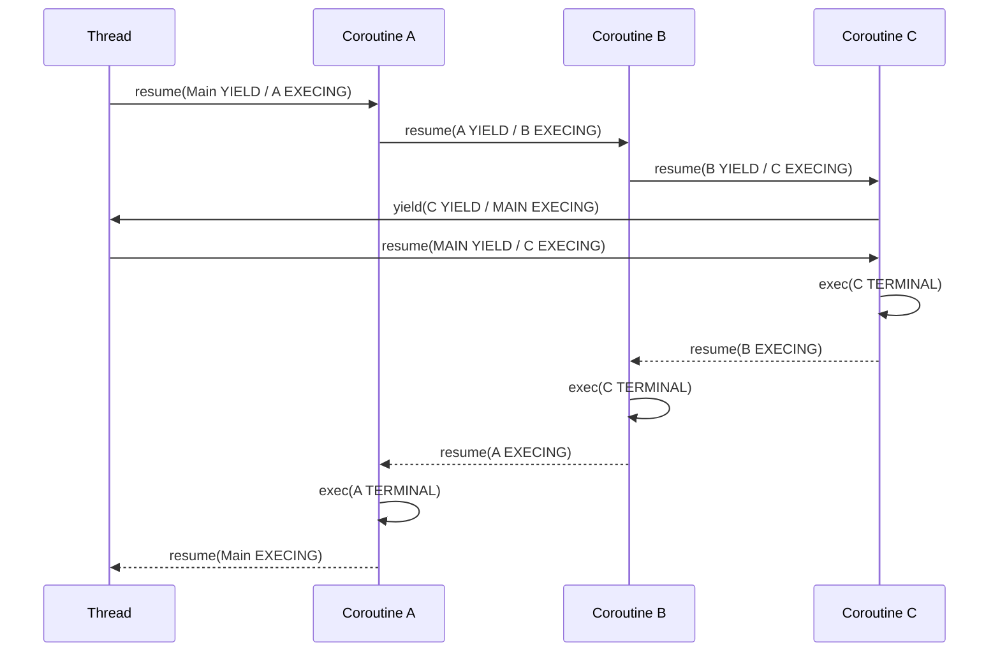

# tigerkin

## 开发环境

* CentOS Linux release 8.4.2105
* gcc version 8.4.1
* gcc-c++ version 8.4.1
* cmake version 3.18.2
* boost version 1.66.0
* boost-devel version 1.66.0
* yaml-cpp version 0.6.2

## 配置系统

使用配置前需要先声明，即约定优于配置，如果没有提前声明配置不会解析对应字段

```cpp
tigerkin::ConfigVar<int>::ptr intCfg = tigerkin::Config::lookup("test.int", (int)8080, "int");
tigerkin::ConfigVar<float>::ptr floatCfg = tigerkin::Config::lookup("test.float", (float)10.2f, "float");
tigerkin::ConfigVar<std::string>::ptr stringCfg = tigerkin::Config::lookup("test.string", (std::string)"Hello", "string");

YAML::Node root = YAML::LoadFile("/home/liuhu/tigerkin/tests/test_conf.yml");
tigerkin::Config::loadFromYaml(root, "test");

TIGERKIN_LOG_INFO(TIGERKIN_LOG_ROOT()) << "int:" << intCfg->getValue();
TIGERKIN_LOG_INFO(TIGERKIN_LOG_ROOT()) << "float:" << floatCfg->getValue();
TIGERKIN_LOG_INFO(TIGERKIN_LOG_ROOT()) << "string:" << stringCfg->getValue();
```

* 支持`std`基本数据类型
	* `std::string`,`std::vector`,`std::list`,`std::set`,`set::unordered_set`,`std::map`,`std::unordered_map`
	* 支持自定义类型(需要自己写对于的偏特化模板)

## 日志系统(同步)

* 日志器支持配置初始化
* 支持标准控制台输出
* 支持文件输出
	* 运行过程中日志文件被误删除，可自动重新生成
* 支持格式自定义

    ```cpp
        XX(m, MessageFormatItem),     // m:消息
        XX(p, LevelFormatItem),       // p:日志级别
        XX(r, ElapseFormatItem),      // r:累计毫秒数
        XX(c, NameFormatItem),        // c:日志名称
        XX(t, ThreadIdFormatItem),    // t:线程id
        XX(n, NewLineFormatItem),     // n:换行
        XX(d, DateTimeFormatItem),    // d:时间
        XX(f, FileNameFormatItem),    // f:文件名
        XX(l, LineFormatItem),        // l:行号
        XX(T, TabFormatItem),         // T:Tab
        XX(F, CoIdFormatItem),        // F:协程id
        XX(N, ThreadNameFormatItem),  // N:线程名称
    ```

```cpp
	TIGERKIN_LOG_INFO(TIGERKIN_LOG_ROOT()) << "default log";
	TIGERKIN_LOG_FMT_INFO(TIGERKIN_LOG_ROOT(), "fmt default %s", "log");
```

```cpp
	tigerkin::Logger::ptr logger(new tigerkin::Logger("SimpleLogTest"));
	tigerkin::LogAppender::ptr stdAppender(new tigerkin::StdOutLogAppend());
	tigerkin::LogFormatter::ptr formater(new tigerkin::LogFormatter("%d{%Y-%m-%d %H:%M:%S} %t %N %F [%p] [%c] %f:%l %m%n"));
	stdAppender->setFormate(formater);
	logger->addAppender(stdAppender);

	tigerkin::LogAppender::ptr fileAppender(new tigerkin::FileLogAppend("./simpleLog.txt"));
	fileAppender->setFormate(formater);
	logger->addAppender(fileAppender);

	TIGERKIN_LOG_DEBUG(logger) << "Hello World";
	TIGERKIN_LOG_INFO(logger) << "Hello World";

	TIGERKIN_LOG_FMT_DEBUG(logger, "fmt Hello %s", "World");
	TIGERKIN_LOG_FMT_INFO(logger, "fmt Hello %s", "World");
```

```yml
	logs:
	- name: SYSTEM
		level: DEBUG
		formatter: "%d{%Y-%m-%d %H:%M:%S} %t %N %F [%p] [%c] %f:%l %m%n"
		appenders:
		- type: StdOutLogAppender
			level: DEBUG
		- type: FileLogAppender
			level: INFO
			file: ./system_log.txt
```

```cpp
	tigerkin::SingletonLoggerMgr::getInstance()->addLoggers("xxx/log.yml", "logs");
		
	TIGERKIN_LOG_DEBUG(TIGERKIN_LOG_NAME(SYSTEM)) << "I am system logger debug";
	TIGERKIN_LOG_INFO(TIGERKIN_LOG_NAME(SYSTEM)) << "I am system logger info";
```

## 线程系统

基于对`pthread`的封装，使用灵活简单

* 信号量
* 支持读写分离互斥锁
	* 注意读锁是线程共享资源
	* 写锁是独占资源
* 多线程
	* 使用简单并且确保在获取到子线程`id`的同时线程已经开始执行
	* 线程号和线程名称与`top`命令中的线程对应
		* `ps -aux | grep threadMutex_`
		* `top -H -p [pid]`
* 线程的挂起与恢复
	```cpp
		void threadFunc() {
			TIGERKIN_LOG_INFO(TIGERKIN_LOG_ROOT()) << "thread begin runing\n"
												<< "\tid:" << tigerkin::Thread::GetThis()->getId(); 
			sleep(3);
			TIGERKIN_LOG_INFO(TIGERKIN_LOG_ROOT()) << "thread info:\n" 
												<< "\tname:" << tigerkin::Thread::GetName() << "\n"
												<< "\tid:" << tigerkin::Thread::GetThis()->getId()
												<< "\t will end";
			// 可以使用相关命令查看线程执行情况
			sleep(20);
		}
		tigerkin::Thread::ptr th(new tigerkin::Thread(&threadFunc, "threadMutex_" + std::to_string(i)));
		th->join();
	```

## 协程系统

基于对`ucontext`封装的非对称协程，使用灵活简单

* 非对称设计，每个协程`coroutine`只有唤醒`resume`和挂起`yield`两个操作，从哪里唤醒，当挂起之后就会回到哪里
* 每个线程在运行运行第一个协程时都会创建一个`Main`协程即线程当前运行切入点
  * 在一个协程被首次唤醒
    * 如果是从`Main`协程唤醒，会创建一个对应的栈并将这个协程放入栈底
    * 如果不是从`Main`协程唤醒，那么会将这个协程放入唤醒这个协程的协程所在栈的栈顶
* `yield`只对栈顶协程生效，因为非栈顶协程已经是`YIELD`状态
  	```cpp
		tigerkin::Coroutine::GetThis()->yield();
  	```
* `resume`只对栈顶协程和未加入栈中的协程生效
  ```cpp
    tigerkin::Coroutine::ptr coA(new tigerkin::Coroutine(&coFunc));
    coA->resume();
  ```

* 可以通过`stackId`来`resume`一个栈的栈顶协程
	```cpp
    	void coFunc() {
			tigerkin::Coroutine::GetThis()->yield();
		}

		void main() {
			tigerkin::Coroutine::ptr co(new tigerkin::Coroutine(&coFunc));
			co->resume();
			TIGERKIN_LOG_DEBUG(TIGERKIN_LOG_NAME(TEST)) << "muilt coroutine test";
			tigerkin::Coroutine::Resume(co->getStackId());
		}
	```



```cpp
  	void co_test_funcC() {
		TIGERKIN_LOG_DEBUG(TIGERKIN_LOG_NAME(TEST)) << "in coroutine C start";
		tigerkin::Coroutine::GetThis()->yield();
		TIGERKIN_LOG_DEBUG(TIGERKIN_LOG_NAME(TEST)) << "in coroutine C end";
	}

	void co_test_funcB() {
		TIGERKIN_LOG_DEBUG(TIGERKIN_LOG_NAME(TEST)) << "in coroutine B start";
		tigerkin::Coroutine::ptr co(new tigerkin::Coroutine(&co_test_funcC));
		co->resume();
		TIGERKIN_LOG_DEBUG(TIGERKIN_LOG_NAME(TEST)) << "in coroutine B end";

	}

	void co_test_funcA() {
		TIGERKIN_LOG_DEBUG(TIGERKIN_LOG_NAME(TEST)) << "in coroutine A start";
		tigerkin::Coroutine::ptr co(new tigerkin::Coroutine(&co_test_funcB));
		co->resume();
		TIGERKIN_LOG_DEBUG(TIGERKIN_LOG_NAME(TEST)) << "in coroutine A end";

	}

	void muilt_coroutine_test() {
		TIGERKIN_LOG_DEBUG(TIGERKIN_LOG_NAME(TEST)) << "muilt coroutine test start";
		tigerkin::Coroutine::ptr co(new tigerkin::Coroutine(&co_test_funcA));
		co->resume();
		TIGERKIN_LOG_DEBUG(TIGERKIN_LOG_NAME(TEST)) << "muilt coroutine test";
		tigerkin::Coroutine::Resume(co->getStackId());
		TIGERKIN_LOG_DEBUG(TIGERKIN_LOG_NAME(TEST)) << "muilt coroutine test end";
	}
```

## 调度器

对协程系统做的进一步封装，使用方便灵活
* 支持多线程操作
	* 初始化调度器时，线程数最好不要超过`CPU`核数(线程上线文切换会消耗一定资源)
* 可指定协程在哪个线程中执行
* 参数`userCaller`可设置度线程(创建调度器的线程)是否要参与协程任务的执行
	* 当`userCaller`为`true`时，在`start`处将会创建相应子线程，调度线程和子线程都会执行协程池中的协程
	* 当`userCaller`为`false`时，在`start`处将会创建相应子线程，子线程会执行协程池中的协程，而度线程会继续向下执行
* 协程任务执行完毕时除调度线程外，所有线程都会陷入挂起状态(让出`CPU`资源)
	* 调度线程将会返回到最初位置(调用调度器`start`的地方)继续向下执行
	* 当有新的协程任务加入时，优先在子线程中执行(协程没有指定线程)
	* 如果`userCaller`为`true`，当协程池中的任务达到一定数量(线程数的`tigerkin.scheduler.tickleCaller`倍)时，调度线程才会切换到执行协程任务

```cpp
	void co_func_a() {
		TIGERKIN_LOG_DEBUG(TIGERKIN_LOG_NAME(SYSTEM)) << "in co A start";
		sleep(0.01);
		TIGERKIN_LOG_DEBUG(TIGERKIN_LOG_NAME(SYSTEM)) << "in co A end";
	}

	void test_scheduler_use_caller() {
		tigerkin::Scheduler::ptr sc(new tigerkin::Scheduler(3, true, "UserCaller"));
		sc->start();
		for (size_t i = 0; i < 10000; ++i) {
			if (i % 2 == 0) {
				tigerkin::Coroutine::ptr co(new tigerkin::Coroutine(&co_func_a));
				sc->schedule(co, 0);
			} else {
				sc->schedule([]() -> void { TIGERKIN_LOG_DEBUG(TIGERKIN_LOG_NAME(SYSTEM)) << "in function A"; }, 0);
			}
		}
		sc->stop();
	}

	void test_scheduler() {
		tigerkin::Scheduler::ptr sc(new tigerkin::Scheduler(3, false, "NotUseCaller"));
		sc->start();
		for (size_t i = 0; i < 10000; ++i) {
			if (i % 2 == 0) {
				tigerkin::Coroutine::ptr co(new tigerkin::Coroutine(&co_func_a));
			} else {
				sc->schedule([]() -> void { TIGERKIN_LOG_DEBUG(TIGERKIN_LOG_NAME(SYSTEM)) << "in function A"; }, 0);
			}
		}
		sc->stop();
	}
```

## I/O管理器

基于`epoll`对调度器的扩展，使用方便，灵活，扩展性高
* 支持多线程操作
* 等待事件将会放入一个新的协程中执行

```cpp
	void co_func_a() {
		TIGERKIN_LOG_DEBUG(TIGERKIN_LOG_NAME(TEST)) << "co func a start";
		sock_a = socket(AF_INET, SOCK_STREAM, 0);
		fcntl(sock_a, F_SETFL, O_NONBLOCK);
		sockaddr_in addr;
		memset(&addr, 0, sizeof(addr));
		addr.sin_family = AF_INET;
		addr.sin_port = htons(80);
		inet_pton(AF_INET, "14.215.177.38", &addr.sin_addr.s_addr);
		if (!connect(sock_a, (const sockaddr *)&addr, sizeof(addr))) {
			TIGERKIN_LOG_DEBUG(TIGERKIN_LOG_NAME(TEST)) << "connect fail";
		} else if (errno == EINPROGRESS) {
			TIGERKIN_LOG_DEBUG(TIGERKIN_LOG_NAME(TEST)) << "add event";
			tigerkin::IOManager::GetThis()->addEvent(sock_a, tigerkin::IOManager::Event::WRITE, []() {
				TIGERKIN_LOG_INFO(TIGERKIN_LOG_NAME(TEST)) << "write connect a";
				close(sock_a);
			});
		} else {
			TIGERKIN_LOG_ERROR(TIGERKIN_LOG_NAME(TEST)) << "ERRNO:" << strerror(errno);
		}
		TIGERKIN_LOG_DEBUG(TIGERKIN_LOG_NAME(TEST)) << "co func a end";
	}

	void test_simple_test() {
		tigerkin::IOManager iom(1, false, "IOManager");
		std::cout << "test_simple_test" << std::endl;
		iom.schedule(&co_func_a);
	}
```